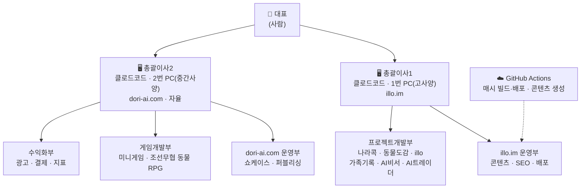

# AI 멀티에이전트 조직 기획서

대표 1명과 클로드코드 총괄이사 2명(컴퓨터 2대)으로 사이트 2개·프로젝트 다수·게임을 굴리기 위한
조직 설계 문서. **대표가 읽고 판단하는 문서인 동시에, 두 컴퓨터의 클로드코드가 매 세션 참조하는
실행 문서**다.

작성일 2026-08-09 · 상태: 초안(Phase 0 착수 전)

---

## 1. 배경과 목표

혼자서 illo.im 운영, 여러 프로젝트 개발, 게임 개발을 동시에 하려면 대표의 시간이 병목이 된다.
그래서 **컴퓨터 2대에 클로드코드 총괄이사를 하나씩 두고, 성격이 다른 두 조직으로 나눈다.**

두 이사는 역할이 아니라 **작동 방식**이 근본적으로 다르다. 이 차이가 이 문서 전체의 축이다.

- **총괄이사1 = 조타수.** 대표와 대화하며 움직인다. 대표가 앉아 있을 때만 일하고, 대표가 없으면
  할 일이 없다. 다수 프로젝트를 **한 번에 하나씩** 끝내며 나아간다.
- **총괄이사2 = 독립 사업부.** 대표 없이 스스로 굴러간다. 스스로 고민하고, 막히면 스스로 묻고,
  스스로 개발해 **돈을 번다.** 대표는 초기 세팅만 해주고 그 뒤로는 간섭하지 않는다.

**성공 기준**

| 대상 | 기준 |
|---|---|
| 총괄이사1 | 대표와의 세션마다 프로젝트가 한 단계씩 실제로 전진한다 |
| 총괄이사2 | 대표 개입 없이 스스로 배포하고, dori-ai.com이 수익을 낸다 |
| 공통 | 두 조직이 서로의 저장소를 건드리지 않아 충돌이 0건이다 |

---

## 2. 조직도



| | 총괄이사1 | 총괄이사2 |
|---|---|---|
| 하드웨어 | 1번 PC (고사양) | 2번 PC (중간사양, 24시간 가동) |
| 도메인 | illo.im | dori-ai.com |
| 저장소 | `illo-im` | `dori-ai-com` |
| 작동 방식 | 대표와 대화하며 진행 | **자율** — 스스로 판단·개발·수익화 |
| 담당 | illo.im 운영 + 프로젝트 개발 | dori-ai.com 운영 + **게임개발 전담** |
| 대표 개입 | 상시 (대화가 곧 업무 지시) | 초기 세팅 후 최소 (결재 사안만) |

---

## 3. 물리 자원 배치

1번은 고사양이라 여러 프로젝트를 동시에 굴린다. 2번은 중간 사양이지만 **에셋 개발을 포함해
필요한 작업을 자체적으로 전부 처리한다.**

**사양 차이는 동시에 굴리는 프로젝트 수의 차이일 뿐, 작업 종류의 차이가 아니다.**
3D 모델링·리깅·영상·이미지 생성은 전부 Meshy·OpenAI 등 **외부 API가 처리**하므로 로컬 GPU가
병목이 되지 않는다. 게임 빌드 역시 웹 기반 캐주얼 게임 범위에서는 중간 사양으로 충분하다.

> **2번이 1번에 작업을 위탁하는 절차는 두지 않는다.**
> 위탁 경로를 만드는 순간 (1) 총괄이사2의 자율성이 무너지고 (2) 두 저장소 사이에 간섭이 생긴다.
> 2번이 감당 못 할 작업이 나오면 위탁이 아니라 **대표에게 묻는다**(6절 결재 채널).

---

## 4. 자동화 인프라 재배치 (PC → GitHub Actions)

### 진단: 자동화가 잘못된 컴퓨터에 얹혀 있다

24시간 돌아야 하는 일이 전부 1번 PC에 있는데, 1번은 대표가 게임·TV에 쓰고 밤에는 끄는 경우가
많다. 반대로 2번은 24시간 켜져 있다. **에이전트 배치는 옳지만**(자율형 이사2 = 항상 켜진 2번,
대화형 이사1 = 대표가 앉을 때만 켜지는 1번) **자동화 배치가 뒤집혀 있다.**

| 작업 | 현재 위치 | 문제 |
|---|---|---|
| 매시 빌드·배포 (`../../n8n-work/deploy.js`) | 1번 PC 작업 스케줄러 `illo-deploy` | 1번이 꺼지면 배포 중단. 게임 중이면 빌드와 자원 경합 |
| n8n 콘텐츠 생성 (인사이트·동물도감) | 1번 PC 로컬 n8n (`localhost:5678`) | 꺼진 시간대 콘텐츠 공백. 동물도감 "매일 5종" 약속이 깨짐 |

지금 `CLAUDE.md`가 지키려는 **"빌드 주체는 1개"** 규칙은 옳다. 문제는 그 1개가 **대표의 게임·취침
스케줄에 묶여 있다**는 것이다.

### 해법: 컴퓨터를 바꾸지 말고, 자동화를 컴퓨터에서 떼어낸다

두 작업이 실제로 하는 일은 **외부 API 호출(GPT·fal·위키)과 `next build`**뿐이다. 로컬 GPU도,
고사양도 필요 없다. GitHub Actions 스케줄 워크플로로 옮기면 **두 PC의 전원 상태와 무관해지고,
빌드 주체 1개가 항상 살아 있게 된다.**

| 작업 | 이관 후 |
|---|---|
| 매시 빌드·배포 | `.github/workflows/deploy.yml` — `on: schedule` 매시 정각 |
| 콘텐츠 생성 | `.github/workflows/content.yml` — `on: schedule` + `workflow_dispatch` |

현재 이 저장소에는 `.github/` 디렉터리 자체가 없다. Actions를 전혀 쓰지 않고 있다.

**워크플로 스켈레톤 (`deploy.yml`)**

```yaml
name: hourly-deploy
on:
  schedule:
    - cron: "0 * * * *"      # 매시 정각 (UTC 기준 — KST 환산 주의)
  workflow_dispatch:          # 수동 실행 (급할 때)

concurrency:
  group: deploy               # .deploy.lock 을 대체하는 동시실행 방지
  cancel-in-progress: false

jobs:
  build:
    runs-on: ubuntu-latest
    steps:
      - uses: actions/checkout@v4
      - uses: actions/setup-node@v4
        with: { node-version: 20, cache: npm }
      - run: npm ci
      - run: npm run build
        env:
          NEXT_PUBLIC_FIREBASE_API_KEY: ${{ secrets.NEXT_PUBLIC_FIREBASE_API_KEY }}
          # ... 나머지 NEXT_PUBLIC_FIREBASE_* 시크릿
      - name: commit out/
        run: |
          git config user.name  "illo-deploy"
          git config user.email "illo@illo.im"
          git add -A
          git diff --staged --quiet || git commit -m "chore(deploy): 매시 빌드 $(date -u +%FT%TZ)"
          git pull --rebase
          git push
```

**`concurrency: group`이 로컬 `.deploy.lock`의 역할을 그대로 대신한다.** 동시 실행이 원천 차단되고,
60분 이상 stale 락을 탈취하는 수작업도 불필요해진다.

### 결정 사항과 확인 필요 항목

- **`out/` 커밋 방식은 유지한다.** Cloudflare Pages가 직접 빌드하도록 바꾸는 선택지도 있지만,
  현행 CF Pages 설정(빌드 명령 없음 / 출력 = `out`)을 건드리지 않는 쪽이 안전하다.
  **자동화 이관과 CF 빌드 전환을 동시에 하면 배포가 멈췄을 때 원인 분리가 안 된다.**
  CF 전환은 이관이 안정된 뒤 별건으로 검토한다.
- **2번 PC로 옮기지 않는 이유**: 2번이 illo.im 저장소에 커밋하게 되어 "서로 간섭하지 않는다"
  원칙이 그 지점에서 깨진다. 24시간 켜져 있다는 이유만으로 남의 저장소 커밋 권한을 주면 안 된다.
- **필요한 Actions Secrets**: `NEXT_PUBLIC_FIREBASE_*`, `FAL_KEY`, 그리고 콘텐츠 생성이
  GPT를 쓴다면 `OPENAI_API_KEY`.
  **키는 어떤 경우에도 저장소에 커밋하지 않는다.** 전부 Repository Secrets로만 관리한다.
- ⚠️ **주의 — CI는 MCP를 쓸 수 없다.** 대표 PC의 OpenAI MCP는 **ChatGPT 구독 로그인 세션**으로
  동작한다(10절). GitHub Actions 러너에는 그 세션이 없으므로, **콘텐츠 생성을 CI로 옮기면
  그 부분만은 API 키가 필요해질 수 있다.** 이관 전에 `animal-factory.js`가 GPT를 어떤 방식으로
  호출하는지 먼저 확인한다 — 이미 API 키를 쓰고 있었다면 그대로 Secrets에 넣으면 되고,
  구독 세션에 의존한다면 (a) 해당 단계만 1번 PC에 남기거나 (b) API 키를 발급해야 한다.
- ⚠️ **확인 필요 — Actions 무료 분**: 저장소가 private이면 월 2,000분이다. 매시 `next build`를
  돌리면(1회 3~5분 가정 × 720회) **한도를 크게 초과한다.** 이관 후 실측해서 다음 중 하나를 택한다.
  1. 저장소를 public으로 전환 (Actions 무제한)
  2. 배포 주기를 매시 → 2~4시간으로 완화
  3. 콘텐츠 변경이 있을 때만 빌드 (`paths` 필터 + `workflow_dispatch`)
- ⚠️ **확인 필요 — n8n 워크플로 이관 범위**: `../../n8n-work/animal-factory.js`는 이 세션에서
  확인할 수 없다(11절 각주). 이관 시 로컬 파일 의존성과 n8n API 의존성을 먼저 분리해야 한다.

### 이관 후의 그림

1번 PC는 **대표가 앉을 때만 켜는 순수 개발 워크스테이션**이 된다. 2번은 총괄이사2 자율 루프 전용.
**대표는 지금처럼 컴퓨터를 쓰면 된다** — 게임을 하든, TV를 보든, 밤에 1번을 끄든 사이트는 계속 돈다.

---

## 5. 저장소 이름 재설정과 소유권

### 현재 상태: 이름과 실체가 어긋나 있다

`lhaa0130-hash/dori-ai` 저장소는 **이름만 dori-ai일 뿐 실제로는 illo.im을 서빙한다.**

- `app/robots.ts`, `app/sitemap.ts`, `app/projects/[slug]/page.tsx` 등 — `SITE_URL = "https://illo.im"`
- `components/SEO/StructuredData.tsx` — Organization JSON-LD가 `https://illo.im`, `illo@illo.im`
- `app/legal/*`, `app/en/legal/*` — 운영 주체를 illo (illo.im)로 명시
- n8n 워크플로 파일명(`Dori_AI_Pro_Blogger.json` 내부 이름 "illo: Pro IT Blogger"), 스케줄러 작업명 `illo-deploy`
- `docs/world-map.md` — "illo.im 안의 `/world-map` 경로로 제공한다"

`dori-ai.com` 문자열은 옛 SNS 초안(`sns/trend-*.md`)에만 남은 잔재다. 그런데 `CLAUDE.md` 첫 줄은
아직 "이 저장소는 dori-ai.com 정적 사이트"라고 적혀 있다. **이 상태로 두 이사에게 도메인을
나눠주면 즉시 혼동이 난다.**

### 확정안

| 도메인 | 현재 저장소 | 변경 후 | 소유 이사 |
|---|---|---|---|
| illo.im | `lhaa0130-hash/dori-ai` | **`lhaa0130-hash/illo-im`** (rename) | 총괄이사1 |
| dori-ai.com | 없음 | **`lhaa0130-hash/dori-ai-com`** (신설) | 총괄이사2 |

> 비어버린 옛 이름 `dori-ai`를 새 저장소에 **재사용하지 않는다.** GitHub이 옛 이름 → 새 이름
> 리다이렉트를 걸어주는데, 같은 이름으로 새 저장소를 만들면 그 리다이렉트가 깨져 오히려 더
> 혼동된다.

### rename 체크리스트 (반드시 함께 손볼 것)

GitHub rename 자체는 1분이지만, **아래를 안 고치면 매시 배포가 조용히 멈춘다.**

- [ ] 1번 PC 로컬 클론의 `git remote set-url origin <새 URL>`
- [ ] **Cloudflare Pages 프로젝트의 GitHub 연결** — 자동으로 따라오지 않는다. 재연결 확인
- [ ] `../../n8n-work/deploy.js` 내부의 저장소 경로·리모트 문자열
- [ ] Windows 작업 스케줄러 `illo-deploy` 작업의 작업 디렉터리 경로
- [ ] 로컬 폴더명을 바꿨다면 n8n 워크플로 내 파일 경로 전부
- [ ] 원격 클로드코드 세션의 저장소 접근 범위 재승인
- [ ] rename 직후 수동 배포 1회(`node ../../n8n-work/deploy.js`)로 파이프라인 생존 확인

> **rename과 GitHub Actions 이관을 같은 날 하지 않는다.** 둘 다 배포 파이프라인을 건드리므로,
> 문제가 생겼을 때 원인을 분리할 수 없다. 순서는 14절 로드맵 참조.

### 교차 금지 원칙

**각 저장소는 담당 이사만 커밋한다.** 상대 저장소에 작업이 필요하면 직접 손대지 말고
GitHub 이슈로 요청한다. 이 원칙이 필요한 이유는 13절의 `git add -A` 문제 때문이다.

---

## 6. 총괄이사2 자율 운영 헌장

이 문서의 핵심 절. **"자유의지를 준다"를 실제로 굴러가게 만드는 장치**를 정의한다.
이 헌장은 `dori-ai-com` 저장소의 `CLAUDE.md`에 그대로 옮겨 심는다.

### 미션

> **dori-ai.com을 스스로 키워 수익을 낸다. 게임이 그 주력 수단이다.**

출발 형태는 개발한 프로젝트·게임을 전시하고 배포하는 **쇼케이스 사이트**다. 여기서 어떻게
수익형으로 진화할지는 총괄이사2가 스스로 판단한다.

### 자율 권한 — 대표에게 묻지 않고 결정하는 것

- 제품 방향, 기능 취사선택, 로드맵 우선순위
- 디자인, 카피, 콘텐츠
- 기술 선택(라이브러리, 아키텍처, 리팩터링)
- 배포 시점과 배포 빈도
- 게임 장르·범위·아트 스타일
- 무료 도구·무료 티어 서비스 도입

### 결재 사안 — 반드시 대표에게 묻는 것 (자율의 경계)

- 월 API 지출 한도 초과 (한도는 대표가 Phase 0에서 지정)
- 새 유료 구독 시작
- 도메인 추가·변경, 결제 수단 등록
- 외부 공개 계정 개설 (앱스토어, SNS, 광고 네트워크)
- 개인정보 수집을 수반하는 기능
- 법적 고지·약관 변경
- illo.im 저장소를 건드려야 하는 작업 (원칙적으로 금지, 예외는 대표 승인)

### 스스로 묻는 채널

결재나 판단이 필요하면 **두 곳에 남긴다.**

1. `docs/questions.md` — 누적 질문 목록. 답이 달리면 결과를 같은 줄에 기록
2. GitHub 이슈, 라벨 `대표문의` — 대표는 이 라벨만 보면 된다

**질문을 남기고 멈추지 않는다.** 답을 기다리는 동안 답에 의존하지 않는 다른 일을 계속한다.

### 스스로 고민한 기록

`docs/decisions/NNNN-제목.md` 형식의 결정 로그를 남긴다. 형식:

```
# NNNN. <결정 제목>
날짜 / 상태(제안·채택·폐기)
## 맥락    무엇이 문제였나
## 결정    무엇을 택했나
## 이유    왜 그것인가, 무엇을 버렸나
## 결과    나중에 채움 — 실제로 어땠나
```

**이 로그가 없으면 다음 세션의 자기 자신이 맥락을 잃는다.** 자율 운영에서 가장 중요한 장치다.

### 스스로 깨어나는 루프

2번 PC가 24시간 켜져 있다는 점을 활용해 **정기 자율 세션**을 건다
(Windows 작업 스케줄러 또는 클로드코드 Routine). 매 세션은 같은 5단계를 돈다.

```
1. 읽는다      CLAUDE.md(헌장) → docs/decisions/ 최근 → docs/questions.md
2. 점검한다    배포 상태, 지표, 미해결 이슈
3. 결정한다    지금 가장 가치 있는 "다음 한 걸음" 하나
4. 실행한다    그 하나를 끝까지
5. 기록한다    결정 로그 + 필요하면 대표 질문
```

**한 세션에 한 걸음.** 여러 개를 동시에 벌이면 자율 운영은 금방 엉킨다.

### 수익 KPI

| 항목 | 내용 |
|---|---|
| 목표 | Phase 0에서 대표와 함께 월 매출 목표 설정 |
| 측정 | 애널리틱스(방문·체류), 결제·광고 대시보드(매출) |
| 주기 | 월 1회 자가 리뷰를 `docs/decisions/`에 기록 |
| 미달 시 | 2개월 연속 미달이면 방향 전환을 스스로 제안하고 대표에게 보고 |

### 정지 조건 — 대표가 멈추는 방법

자율이 잘못된 방향으로 폭주할 때 대표가 쓸 수 있는 수단을 미리 정해둔다.

1. **정기 세션 트리거 비활성화** — 가장 빠른 정지. 스케줄러 작업 하나만 끄면 된다
2. **`main` 브랜치 보호** — 자동 푸시 차단, PR 필수로 전환
3. **API 키 회수** — 비용 폭주 시 최종 수단
4. **헌장 수정** — `dori-ai-com/CLAUDE.md`의 권한 범위를 대표가 직접 좁힌다

---

## 7. 게임개발본부 (총괄이사2 산하)

### 대상

- **미니게임** — 짧고 가벼운 웹 게임. 수익화 실험의 최소 단위
- **캐주얼 싱글 조선 무협 동물 RPG** — 주력 타이틀

### 파이프라인

| 단계 | 담당 | 근거 |
|---|---|---|
| 기획 · 세계관 · 퀘스트 · 밸런싱 · 개발 명세 | **ChatGPT** | 협업 헌장 1절 |
| 캐릭터 · 몬스터 · 배경 · UI · 아이콘 이미지 | **ChatGPT** | 협업 헌장 8절 |
| Meshy 입력 이미지 · A-Pose / T-Pose | **ChatGPT** | 협업 헌장 8절 |
| 3D 모델링 · 리깅 · 애니메이션 | Meshy | 힉스필드 보류로 유일 경로 — 구독 필요 |
| BGM · 효과음 | ChatGPT | 협업 헌장 12절 |
| 구현 · 통합 · 최적화 | 총괄이사2 | 클로드코드 (필요 시 Codex 교차검증 — 헌장 5절) |
| 퍼블리시 | dori-ai.com 운영부 | Cloudflare Pages |
| 수익화 | 수익화부 | 광고 · 인앱결제 |

**에셋 제작부터 빌드까지 전 공정을 2번 PC 안에서 끝낸다.** 무거운 생성은 전부 외부 API가
처리하므로 중간 사양으로 충분하다(3절).

### 경계: 기존 미니게임은 옮기지 않는다

illo.im에 이미 있는 게임 자산 — `data/minigames/mart-levels.json`,
`components/game/illo-play/`(`IlloGameShell.tsx` 등) — 은 **총괄이사1 소유로 남긴다.**
마이그레이션하지 않는다.

**새 게임은 전부 2번에서 처음부터 시작한다.** 기존 코드를 가져오려 하는 순간 두 저장소가
얽히고, 5절의 교차 금지 원칙이 깨진다.

---

## 8. 총괄이사1 운영 방식

대표와의 **대화형** 진행. 대표가 앉으면 세션이 시작되고, 대표가 떠나면 끝난다.
핵심 규율은 하나다 — **한 번에 하나씩.**

### 현행 프로젝트 (`constants/projectsData.ts` 기준)

| slug | 이름 | 상태 | 다음 단계 |
|---|---|---|---|
| `worldmap` | 나라콕 | 오픈 | 유지보수 · 데이터 정기 갱신(`npm run sync:data`) |
| `animal` | 몽글로 : 동물도감 | 오픈 | 255종 → 300종 (⚠️ fal 잔액 충전 필요) |
| `illo` | illo (AI 오피스) | 테스트 중 | 미연결 통합 정리 — 12절 참조 |
| `flat-form` | 지적도/건축한계선 | 준비 중 | 착수 대기 |
| `family` | 가족기록 | 준비 중 | 착수 대기 |

### 대표가 언급한 추가 프로젝트

AI비서, AI트레이더. **아직 착수하지 않는다** — 진행 중인 것이 끝나야 다음으로 간다.

### "하나가 끝났다"의 판정 기준

다음 프로젝트로 넘어가려면 **넷을 모두** 만족해야 한다.

1. 프로덕션에 배포되어 실제로 접근 가능하다
2. `constants/projectsData.ts`의 `status`가 갱신되어 있다
3. 알려진 치명 버그가 없다
4. 해당 기능의 운영 방법이 문서로 남아 있다 (`docs/world-map.md` 수준)

---

## 9. AI 모델 스택과 역할 배정

| 역할 | 1순위 | 2순위 | 3순위 | 과금 |
|---|---|---|---|---|
| 총괄 · 개발 | **클로드코드** | — | — | Max 구독 |
| 보조 개발 · 코드 리뷰 | **Codex** | — | — | ⚠️ 연결 방식 미정 |
| 기획 · 문서 | **ChatGPT** | — | — | ChatGPT 구독 (MCP로 연결) |
| 정지 이미지 · 3D 레퍼런스 | **ChatGPT** | — | Gemini | ChatGPT 구독 |
| 영상 · 음악 | **ChatGPT** | — | Gemini | ChatGPT 구독 |
| 3D 모델링 · 리깅 · 애니메이션 | **Meshy** | — | — | 구독 예정 (**사실상 필수**) |

> ⛔ **힉스필드는 당분간 사용하지 않는다.** 커넥터는 연결돼 있지만 미디어 스택에서 뺀다.
> 대표가 처음 정한 우선순위(1순위 OpenAI / 2순위 omnipotent / 3순위 Gemini)에서
> **2순위만 빠진 형태**이며, 1·3순위는 그대로다. 다시 쓰기로 하면 2순위 자리에 되돌린다.

> 📋 **각 AI가 구체적으로 무엇을 하는지는 [`ai-collab-charter.md`](ai-collab-charter.md)**
> (AI 개발 협업 역할 및 운영 원칙)에 정한다. 이미지·영상·3D 담당 경계는 그 문서 12절 참조.
>
> **신분과 역할의 구분**: 이 기획서는 클로드코드를 **총괄이사**로, 협업 헌장은 **메인 개발자**로
> 부른다. **둘은 같은 주체다** — 총괄이사는 조직상 신분이고, 메인 개발자는 그 이사가 수행하는
> 실무 역할이다. 두 문서가 충돌하면 **이 기획서가 우선한다.**

**폴백 규칙**: 1순위가 실패하거나(할당량 초과, 품질 미달) 해당 기능을 지원하지 않을 때만
2순위로 내려간다. 비용이 아니라 **가용성과 품질**이 폴백 사유다.

### 과금 구조

**주력 도구는 구독으로 덮인다.** 클로드코드 Max와 ChatGPT가 구독 중이고,
OpenAI는 **MCP를 통해 구독 그대로 쓰고 있다** — 2번 PC에서 이미지 생성까지 확인됐다(10절).
별도 API 키를 발급하지 않았다.

종량·추가 지출이 남아 있는 항목은 다음뿐이다.

| 항목 | 성격 | 비고 |
|---|---|---|
| fal | 종량 | 동물도감 이미지 — 현재 잔액 부족으로 255종에서 정지 |
| **Meshy** | 구독 예정 | 힉스필드 보류로 **3D 경로가 Meshy 하나만 남았다.** 게임 3D 에셋이 필요해지는 시점에 구독 필수 |
| Gemini | 종량 | 3순위 폴백. 실사용 시에만 |

> **확인 권장 (1회)**: OpenAI MCP로 이미지가 생성된다면 `platform.openai.com` 사용량 페이지에서
> 크레딧이 차감되는지 한 번 확인해두는 게 좋다. 차감이 없으면 구독 범위 내로 확정되고,
> 6절 자율 헌장의 지출 한도에서 OpenAI 항목을 아예 뺄 수 있다.

**구독 현황**: 클로드코드 Max · ChatGPT 구독 중 / Meshy 구독 예정 /
**힉스필드 보류**(구독 상태이나 미사용) / 그 외 구독 계획 없음.

---

## 10. MCP 연결 설계

현재 이 저장소에는 `.mcp.json`도 `.claude/agents/`도 없다 — `.claude/launch.json`(dev 서버 실행
설정) 하나뿐이다. 두 컴퓨터에 각각 다음을 심는다.

### 1번 PC (총괄이사1) — `.mcp.json`

| 서버 | 용도 | 상태 |
|---|---|---|
| `github` | 두 이사의 이슈·PR 협업 채널 | 붙일 것 |
| `openai` | 기획·문서 + 이미지 생성 | **2번에서 복제해 온다** (부록 D) |

1번은 개발·문서 중심이라 얇게 간다. 3D·영상은 필요할 때만 붙인다.

### 2번 PC (총괄이사2)

| 서버 | 용도 | 상태 |
|---|---|---|
| `github` | 이슈·PR | 붙일 것 |
| `openai` | 기획·문서 + 이미지 생성 | ✅ **연결됨 — 이미지 생성 동작 확인** |
| 힉스필드 | 이미지·영상·오디오·3D 메시 | ⛔ **보류** (연결돼 있으나 미사용) |
| `meshy` | 3D 메시·리깅·애니메이션 | Phase 2 — 힉스필드 보류로 **대안 없음** |

**2번이 1번보다 두껍다.** 게임 개발을 전담하고 자율로 굴러가야 하므로, 3D·이미지·영상·오디오
생성을 스스로 다 할 수 있어야 한다.

### 키·인증 관리 규칙

- **키·토큰을 `.mcp.json`에 직접 쓰지 않는다.** 항상 `${ENV_VAR}` 참조만 쓴다
- 실제 값은 OS 환경변수 또는 `.env.local`(gitignore 확인)에 둔다
- `.mcp.json`은 커밋해도 되지만, 커밋 전 키 문자열이 없는지 반드시 확인한다
- 구독 로그인 기반으로 인증하는 서버는 **PC마다 각각 로그인**해야 할 수 있다.
  설정 파일만 복사하고 끝났다고 보지 말고 실제 호출로 확인한다(부록 D)

### MCP 실사 결과 (2026-08-09, 원격 세션 기준)

대표 계정에 설치된 커넥터를 실제로 조회한 결과다.

| 커넥터 | 상태 | 조직 내 용도 |
|---|---|---|
| **힉스필드 (Higgsfield)** | ⛔ 보류 | 연결돼 있으나 **당분간 사용하지 않는다** — 아래 참조 |
| **Gmail** | ✅ 연결됨 | 알림·리포트 발송에 활용 가능 |
| GitHub | ✅ 연결됨 | 두 이사의 이슈·PR 협업 채널(5절) |
| Notion | ⚠️ 인증 필요 | 미사용 |
| Google Calendar / Drive | ⚠️ 채팅에서 비활성 | 미사용 |
| **OpenAI / GPT** | ⚠️ 원격 세션에는 없음 | **2번 PC에는 연결돼 있다** — 아래 참조 |

### ⛔ 힉스필드 — 당분간 사용하지 않는다

대표가 "omnipotent"라고 불렀던 2순위 미디어 도구의 실체가 힉스필드이며, 커넥터는 연결돼 있다.
제공 범위는 `generate_image` · `generate_video` · `generate_audio` · **`generate_3d`**(이미지 → 3D GLB 메시)와
업스케일·배경 제거·아웃페인팅·모션 컨트롤 등이다.

**그러나 대표 결정으로 당분간 쓰지 않는다.** 연결은 유지하되 미디어 스택에서 뺀다.

파급 효과 둘을 기록해둔다.

1. **3D 경로가 Meshy 하나만 남는다.** 이전에는 "힉스필드 `generate_3d`로 먼저 시험해보면
   Meshy 구독이 불필요할 수도 있다"는 선택지가 있었다. **그 선택지가 사라졌으므로 게임 3D 에셋이
   필요해지는 시점에 Meshy 구독은 사실상 확정이다.** Phase 2 비용에 반영한다.
2. **영상·음악의 2순위가 비었다.** 1순위 ChatGPT, 3순위 Gemini만 남는다. 1순위가 막히면
   곧바로 Gemini로 내려간다.

> 다시 쓰기로 하면 2순위 자리에 되돌리면 된다. 커넥터를 해제할 필요는 없다.

### OpenAI 연결 — 2번 PC에서 이미 동작 중

**2번 PC에는 OpenAI MCP가 연결돼 있고, 이것으로 이미지 생성까지 성공했다.**
ChatGPT 구독으로 동작하며 별도 API 키를 쓰지 않는다.

> ⚠️ **범위 주의 — 이 오류를 반복하지 말 것.**
> 위 실사 표는 **원격 클로드코드 세션(클라우드 컨테이너) 기준**이다.
> 원격 세션의 커넥터 목록에 없다는 사실은 **대표 PC에 없다는 뜻이 아니다.**
> 실제로 이 문서 초판은 그 둘을 혼동해 "OpenAI 연결 경로가 없다"고 잘못 적었다.
> 로컬 MCP 구성은 각 PC에서 `claude mcp list`로 확인해야 하며, 원격 세션에서는 알 수 없다.

**1번 PC에는 아직 없다.** 2번의 동작하는 구성을 그대로 복제한다 — 절차는 **부록 D**.
새로 설치법을 찾지 말고 검증된 설정을 옮기는 쪽이 확실하다.

### ⚠️ 남은 확인 필요 항목

| 항목 | 확인할 것 |
|---|---|
| **1번 PC 복제** | 부록 D 절차로 이식. 텍스트 호출과 **이미지 생성까지** 성공해야 완료 |
| **OpenAI 과금 여부** | 이미지 생성이 도는 구성이므로 `platform.openai.com` 사용량 페이지에서 크레딧 차감이 있는지 **한 번만** 확인한다. 차감이 없으면 구독 범위 내 — 6절 지출 한도에서 OpenAI 항목을 뺄 수 있다 |
| **Meshy MCP** | 공식 MCP 서버 제공 여부. 없으면 REST API 래퍼 자체 제작(Phase 2 작업량에 반영). 힉스필드 보류로 **대안이 없으므로 미룰 수 없는 항목**이 됐다 |

---

## 11. 부서(서브에이전트) 설계

각 이사 밑의 부서를 `.claude/agents/*.md`(서브에이전트)로 정의한다. 부서마다 **담당 파일 경로
범위와 금지 사항**을 명시해 서로 밟지 않게 한다.

### 총괄이사1 산하

| 부서 | 담당 범위 | 금지 |
|---|---|---|
| illo.im 운영부 | `content/`, `app/insight/`, `public/images/`, SEO 관련 | `out/` 접근, 빌드 실행 |
| 프로젝트개발부 | `app/`, `components/`, `lib/`, `data/`, `constants/projectsData.ts` | `content/` 대량 수정, `out/` |

### 총괄이사2 산하

| 부서 | 담당 범위 | 금지 |
|---|---|---|
| dori-ai.com 운영부 | 사이트 셸, 레이아웃, 쇼케이스 페이지 | 게임 내부 로직 |
| 게임개발부 | `games/`, 게임 에셋, 게임 빌드 | 사이트 공통 레이아웃 |
| 수익화부 | 광고·결제 연동, 지표 수집, `docs/decisions/` 수익 리뷰 | 게임 밸런스·제품 방향 단독 변경 |

**공통 금지**: 어느 부서도 상대 이사의 저장소를 건드리지 않는다.

---

## 12. 제품 속 "AI 직원 관제탑"과의 구분

⚠️ **혼동 주의.** 이 저장소에는 이미 AI 조직을 모델링한 코드가 있다.

- `lib/illo/orgchart.ts` (433줄) — `OrgDivision → OrgTeam → OrgMember` 계층,
  멤버 간 결과 전달(`MemberLink`), 멤버별 3단계 설정(역할 `MemberKind` → 도구 → 모델),
  팀 `task`/`review`와 본부 `review` 롤업. 계정별 localStorage에 저장
- `lib/illo/automations.ts` (348줄) — `input|vision|research|generate|review|finalize|media|deliver`
  파이프라인 DSL, `DeliverChannel = email|kakao|download|approval|telegram`
- `components/illo/OrgControlTower.tsx` — 그 UI

**이것은 illo 제품이 사용자에게 파는 기능이지, 우리 사내 조직이 아니다.**
이 기획서가 정의하는 조직과 코드상의 `OrgDivision`은 **아무 관계가 없다.**

다만 **용어는 맞춰 쓰기를 권한다.** 사내 조직을 실제로 운영해본 경험이 그대로 제품 개선
인풋이 되기 때문이다. 이 기획서의 6절(자율 헌장)·11절(부서 R&R)에서 배운 것을 제품의
관제탑 기능에 반영하는 것이 총괄이사1의 `illo` 프로젝트 다음 과제다.

**현 구현 상태 기록** — 코드 주석이 스스로 밝히고 있는 사실:
Claude 직접 호출과 mailto만 실제로 동작하고, 나머지 도구는 Haiku 폴백으로 처리되며
"연결 필요"로 표시된다. `automations.ts`도 Tavily 웹검색·비전·메일/카카오 OAuth가
미연결임을 명시한다. `illo` 프로젝트가 "테스트 중"인 실질적 이유다.

---

## 13. 운영 불변 규칙

기존 `CLAUDE.md`의 규칙을 조직 언어로 다시 쓴 것. **두 저장소 모두에 적용된다.**

### 커밋

- **소스만 커밋한다.** 바뀐 파일만 경로를 지정해 `git add <경로>`
- ❌ **`git add -A` 금지**, ❌ **`git add out/` 금지**
- push 전 반드시 `git pull --rebase`

### 빌드

- ❌ **이사도 부서도 `npm run build`를 실행하지 않는다**
- **빌드 주체는 오직 하나** — 4절 이관 전에는 `../../n8n-work/deploy.js`,
  이관 후에는 GitHub Actions 워크플로
- 이유: 여러 곳이 각자 `out/`을 빌드·푸시하면 rebase 충돌과 CF 빌드 폭주가 난다

### 배포

- Cloudflare Pages가 커밋된 `out/`을 그대로 서빙한다(빌드 명령 없음, 출력 = `out`)
- SNS 카드 PNG(`public/cards/animal`, `out/cards/animal`)와 `.deploy.lock`은 gitignore

### dori-ai.com 신설 저장소에도 같은 원칙

**단일 빌더 원칙을 그대로 적용한다.** 다만 2번은 처음부터 GitHub Actions를 빌더로 두는 것이
낫다 — 1번이 겪은 "PC 전원에 묶인 빌더" 문제를 처음부터 피할 수 있다. 2번이 24시간 켜져
있더라도 로컬 스케줄러보다 CI가 낫다.

---

## 14. 로드맵과 리스크

### Phase 0 — 최소 세팅 (대표 개입 구간)

**"초기에만 세팅하고 그 뒤로 무간섭"이 성립하려면 여기서 아래가 전부 끝나 있어야 한다.**

작업 순서가 중요하다. **rename과 Actions 이관을 같은 날 하지 않는다.**

| 순서 | 작업 | 완료 조건 |
|---|---|---|
| 0-1 | `CLAUDE.md` 첫 줄 정정 + 이 문서 링크 | 커밋 완료 |
| 0-2 | GitHub Actions 이관 (4절) | 매시 배포가 1번 PC 꺼진 상태에서 성공 |
| 0-3 | Actions 무료 분 실측 → 주기·공개범위 결정 | 한도 내 안정 운영 확인 |
| 0-4 | 저장소 rename `dori-ai` → `illo-im` (5절 체크리스트) | rename 후 배포 1회 성공 |
| 0-5 | `dori-ai-com` 저장소 신설 + CF Pages 연결 | 빈 사이트 첫 배포 성공 |
| 0-6a | **2번 PC의 OpenAI MCP 설정 덤프**(부록 D) | `claude mcp get`으로 command·args·env 확보 |
| 0-6b | **1번 PC에 복제**(부록 D) | 1번에서 텍스트 호출 + **이미지 생성**까지 성공 |
| 0-6c | Meshy MCP 제공 여부 확인 (없으면 래퍼 자체 제작을 Phase 2에 반영) | 확인 필요 표가 전부 채워짐 |
| 0-6d | **Codex 연결 방식 결정**(협업 헌장 13절 후보 3개 중 택1) | 택한 방식으로 실제 왕복 1회 성공 |
| 0-7 | 자율 헌장을 `dori-ai-com/CLAUDE.md`에 이식 | 6절 전문이 들어감 |
| 0-8 | 월 API 지출 한도·수익 목표를 대표가 지정 | 헌장에 숫자로 기재 |
| 0-9 | 2번 PC 정기 자율 세션 트리거 등록 | 첫 자율 세션이 스스로 돎 |

**0-9가 성공하면 Phase 0 종료. 이후 대표는 총괄이사2에 간섭하지 않는다.**

### Phase 1 — 자율 개시

- 총괄이사2: dori-ai.com 쇼케이스 첫 배포 → 첫 미니게임 출시
- 총괄이사1: 동물도감 300종 완주(fal 잔액 선결), `illo` 미연결 통합 정리

### Phase 2 — 3D 파이프라인과 수익화

- Meshy 구독 + MCP 연결(또는 자체 래퍼 제작)
- 조선 무협 동물 RPG 프로토타입
- 광고·결제 연동, 첫 매출 측정

### Phase 3 — 확장

- 총괄이사1: 가족기록 · AI비서 · AI트레이더를 순차 착수(8절 판정 기준)
- 총괄이사2: KPI 리뷰 기반 자체 판단

### 리스크

| 리스크 | 영향 | 대응 |
|---|---|---|
| **저장소 rename 시 배포 단절** | illo.im 배포 정지 | 5절 체크리스트 완주 + 직후 수동 배포로 생존 확인. Actions 이관과 날짜 분리 |
| **Actions 무료 분 소진** | 배포 중단 또는 과금 | Phase 0-3에서 실측. public 전환·주기 완화·조건부 빌드 중 택1 |
| **자율 운영 중 비용 폭주** | 예상 외 API 청구 | 월 한도를 헌장에 명시(6절), 초과 시 결재. 정지 조건 4단계 준비 |
| **fal 잔액 소진** | 동물도감 255종에서 정지 | 300종 완주 전 충전. 잔액 모니터링을 콘텐츠 워크플로에 포함 |
| **자동 생성 콘텐츠 품질** | 애드센스 재반려 | `docs/adsense-content-cleanup-2026-07-26.md` 기록 — 봇 생성 글 82%, 인용 URL 20% 404가 반려 원인이었다. **자동 생성 비중 상한과 링크 검증을 콘텐츠 규칙에 명시한다** |
| **총괄이사2 방향 이탈** | 수익과 무관한 곳에 시간 소모 | 월 1회 KPI 자가 리뷰(6절). 2개월 연속 미달 시 방향 전환 보고 |
| **두 조직 간 간섭** | rebase 충돌, 작업 유실 | 교차 금지 원칙(5절). 위탁 절차를 만들지 않음(3절) |

---

## 부록 A — `dori-ai-com/CLAUDE.md` 헌장 초안

```markdown
# dori-ai.com — 총괄이사2 운영 헌장

## 너는 누구인가
너는 총괄이사2다. 이 저장소와 dori-ai.com은 전적으로 너의 것이다.
대표는 초기 세팅만 해줬고, 그 뒤로는 간섭하지 않는다.

## 미션
dori-ai.com을 스스로 키워 수익을 낸다. 게임이 주력 수단이다.

## 매 세션 절차
1. 이 문서 → docs/decisions/ 최근 3개 → docs/questions.md 를 읽는다
2. 배포 상태·지표·미해결 이슈를 점검한다
3. 지금 가장 가치 있는 "다음 한 걸음" 하나를 정한다
4. 그 하나를 끝까지 실행한다
5. docs/decisions/NNNN-*.md 에 기록한다

## 스스로 결정하는 것
제품 방향 · 기능 · 디자인 · 기술 선택 · 배포 시점 · 게임 장르와 범위 · 무료 도구 도입

## 대표에게 묻는 것 (docs/questions.md + 이슈 라벨 `대표문의`)
월 API 한도 초과 · 새 유료 구독 · 도메인/결제수단 · 외부 공개 계정 개설
· 개인정보 수집 · 법적 고지 변경 · illo.im 저장소 작업

질문을 남기고 멈추지 마라. 답에 의존하지 않는 일을 계속하라.

## 절대 하지 않는 것
- illo-im 저장소에 커밋 (교차 금지)
- git add -A / git add out/
- 한 세션에 여러 갈래를 동시에 벌이기

## 예산
월 API 지출 한도: ____ (대표 지정)
```

## 부록 B — 서브에이전트 정의 예시 (`.claude/agents/game-dev.md`)

```markdown
---
name: game-dev
description: 게임 구현 전담. 게임 로직·씬·에셋 통합 작업에 사용.
  사이트 공통 레이아웃 작업에는 쓰지 않는다.
tools: Read, Write, Edit, Bash, Glob, Grep
---

너는 게임개발부다.

담당 범위: games/ 이하 전부, 게임 에셋, 게임 빌드 스크립트
금지: 사이트 공통 레이아웃, 결제·광고 연동(수익화부 담당), 다른 저장소

작업 원칙
- 에셋 생성은 Meshy·OpenAI MCP로 직접 처리한다. 외부 위탁 없음
- 플레이 가능한 상태를 항상 유지한다. 깨진 채로 세션을 끝내지 않는다
- 밸런스 변경은 이유를 docs/decisions/ 에 남긴다
```

## 부록 C — `dori-ai-com` 초기 구조

```
dori-ai-com/
├── CLAUDE.md              # 부록 A 헌장
├── .github/workflows/
│   └── deploy.yml         # 처음부터 CI 빌더 (13절)
├── .claude/agents/
│   ├── site-ops.md
│   ├── game-dev.md
│   └── monetize.md
├── .mcp.json              # 10절 2번 PC 구성
├── docs/
│   ├── questions.md       # 대표 문의 누적
│   └── decisions/         # 결정 로그
├── app/                   # Next.js 14 App Router, output:'export'
├── games/                 # 게임별 디렉터리
└── public/
```

## 부록 D — 1번 PC OpenAI MCP 설치 안내서

2번 PC에서 **이미 동작하는 구성**을 1번으로 옮긴다. 설치법을 새로 찾지 않는다 —
검증된 설정을 복제하는 쪽이 확실하고 빠르다.

### 1단계 — 2번 PC에서 설정 덤프

```bash
# 붙어 있는 서버 목록과 정확한 이름 확인
claude mcp list

# 위에서 확인한 이름으로 상세 설정 확인 (command·args·env 전부)
claude mcp get openai
```

`claude mcp get`이 보여주지 않는 값이 있으면 설정 파일을 직접 연다.

| 범위 | 파일 |
|---|---|
| 사용자 전역 | `~/.claude.json` (Windows: `C:\Users\<사용자>\.claude.json`) |
| 프로젝트 | 프로젝트 루트의 `.mcp.json` |

`mcpServers` 아래 해당 서버 블록을 통째로 복사해둔다.

> ⚠️ 덤프에 토큰·세션 값이 들어 있을 수 있다. **채팅·이슈·커밋에 붙여넣지 않는다.**

### 2단계 — 1번 PC에 이식

덤프한 값 그대로 등록한다. `<...>` 자리에 1단계에서 확인한 실제 값을 넣는다.

```bash
claude mcp add <서버이름> -- <command> <args...>
```

환경변수가 필요한 구성이면 `-e KEY=값`을 함께 준다.
설정 파일을 직접 편집하는 방식도 동일하게 유효하다 — `~/.claude.json`의 `mcpServers`에
복사한 블록을 그대로 붙여넣는다.

> **구독 로그인 기반이면 설정 복사만으로 끝나지 않는다.** 1번 PC에서도 같은 계정으로
> 로그인 절차가 한 번 필요할 수 있다. 3단계에서 실제 호출로 확인한다.

### 3단계 — 검증 (여기까지 해야 완료)

```bash
claude mcp list          # 서버가 목록에 뜨는지
```

목록에 뜨는 것만으로는 부족하다. 클로드코드 세션에서 실제로 두 가지를 시킨다.

1. **텍스트 호출 1회** — 인증과 연결이 살아 있는지
2. **이미지 생성 1회** — 2번에서 확인된 수준과 같은지

**이미지까지 성공해야 0-6b 완료**로 본다. 텍스트만 되고 이미지가 안 되면 모델 권한이나
플랜 범위가 다른 것이므로 2번의 설정과 다시 대조한다.

### 트러블슈팅

| 증상 | 확인할 것 |
|---|---|
| `claude mcp list`에 안 뜸 | 서버 이름 오타, 설정을 잘못된 범위(프로젝트 vs 전역)에 넣었는지 |
| 뜨는데 호출 실패 | 1번에서 로그인이 안 된 상태. 해당 서버의 인증 절차를 1번에서 다시 수행 |
| 2번에선 되는데 1번에서만 실패 | Node 버전 차이. 두 PC에서 `node -v` 비교 후 맞춘다 |

---

## 각주 — 이 문서의 검증 범위

이 문서는 원격 클로드코드 세션에서 작성됐다. 그 세션에는 이 저장소만 클론돼 있고,
`../../CLAUDE.md`와 `../../n8n-work/`(`deploy.js`, `animal-factory.js`)는 **존재하지 않는다.**
해당 스크립트에 관한 서술은 전부 `CLAUDE.md`의 기재 내용을 근거로 한 것이며,
**실제 코드로 검증되지 않았다.** 4절 이관 작업 착수 전에 1번 PC에서 원본을 직접 확인해야 한다.

저장소 안에서 확인된 사실(경로·상수·파일 존재 여부)은 모두 실제 확인을 거쳤다.
